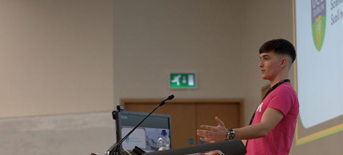

<h2 align="center"><code>/root/usr/bin/whoami</code></h2>

---
<h3 align="center"><b>About</b></h3>

Hello there! My name is Cian Kehoe. I enjoy backend software engineering and operations work, with a focus on reliability.

Always looking to learn, and especially curious about distributed systems.

More recently exploring green/energy efficient computing, and program transformation/optimization & analysis. Currently diving into Go and Rust.

<h3 align="center"><b>Experience & Involvement</b></h3>

<li align="center">Software Engineer Intern @ <a href="https://hubspot.com">HubSpot</a></li>
<li align="center">Two-Time Software Engineer & Research Intern @ <a href="https://waltoninstitute.ie/">Walton Institute</a> (formerly <a href="https://en.wikipedia.org/wiki/TSSG">TSSG</a>)</li>
&nbsp;
<li align="center">Chairperson | SysAdmin | Vice-Chaiperson | Ordinary Member @ <a href="https://redbrick.dcu.ie">Redbrick</a> </li>
<li align="center">Organiser @ <a href="https://sistemconf.com">SISTEM 2019 | 20 | 21 | 22</a></li>

---

<h3 align="center"><b>Contact</b></h3>

Get in touch, connect, or just have a browse of my LinkedIn!

&nbsp;

